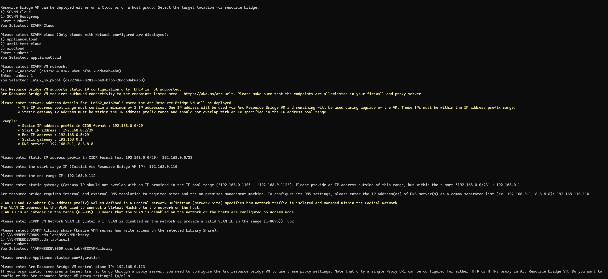

**Error Code ID:** KVAInvalidEntityCustomerError

**Description**
  
The specified VLAN Id _X_ is not available on VM Network _******_

**Explanation**

During Azure Arc resource bridge (ARB) deployment on a SCVMM managed datacenter, there are a few validations done before the ARB VM deployment. Once such validation is for the network configuration used during ARB deployment script execution. Once the ARB VM is created, it will be assigned an IP from the StartIP and EndIP range which is prompted by CLI during the onboarding script execution. If the network configuration specified is not correct, the IP assigned from this range on ARB VM will not be reachable from workstation machine and the ARB deployment will fail. 

Below is how the user experience looks like once the ARB deployment is triggered from workstation machine and if there is no VMM IPPool configured as part of VMM Infrastructure chosen as the deployment target for the ARB during the script execution:

To summarize :

If there are IPPools present as part of VMM Server and associated with the chosen HostGroup/Cloud, it will be used for ARB deployment and the user will not be prompted to provide any VLAN ID as it is already configured within the Logical Network definition.

If there are no IPPools associated with the chosen HostGroup/Cloud, custom IP pool input experience will kick in and custom IP inputs will be prompted to the user (as shown in the above image). As part of this experience, the user is asked to provide VLAN ID and if the specified VLAN ID is incorrect, one will end up in getting the above validate error. Below are a few ways to identify the correct VLAN ID:

**If VMM Logical switch is used.**

i) Open VMM Console

ii) Identiy the Logical Network associated with the VM Network which was selected during ARB deployment. ***Open VMM Console -> VM Network -> Double Click and open the VM Network which was used during deployment***. It will be associated with a logical network. Take a note of the same.

iii) Check the properties of Host (within the HG or associated with Cloud which was selected for ARB deployment) and identify which Logical switch is associated with the same. ***Host Properties -> Virtual Switches***

iv) ***Open Fabric -> Logical Switches -> Logical Switch property (Name identified from previous step) -> Uplinks (port profile name)***. This will have a few Logical Network Definitions (Network sites) associated with Logical Network and marked as enabled.

v) Match and identiy the Logical Network Definitions (Network Site) associated with the Logical Network (as identified in step (ii) above)

vi) ***Open VMM Console -> Fabric ->  Logical Networks -> Open Logical Network (identified in Step (ii) above) -> Network Site***

    As part of this there can be more than one Network site associated with the Logical Network. Each will have a VLAN ID associated with the same. If there is no vlan ID present it is assumed that vlan ID will be 0 which means vlan is disabled.
    
    Please consider updating the Network site in above step with correct vlan which is being planned to be used and use the same during ARB deployment.

    Incase if there is some issues/open points due to which any existing Network Site is not updated with the expected VLAN we can create a new network site and fill the vlan and subnets.
    
    As part of this flow only if we click on ADD -> Network site,  it will open text boxes to provide vlan ID and subnet. Please create the same and save the ocnfiguration.

    Once the Network site is created we need to go an update the Uplink port profile so that it allows us to use this network site for ARB deployment.

    VMM Console -> Fabric -> Port Profiles -> Open Port profile (identied as part of step iv above i.e Uplinks (port profile name))
    -> Network Configuration -> Select the newly created Network Site (Logical Network Defination)

**How to Get the correct VLAN ID if Standard switch is used.**
   
i) Open VMM Console

ii) First we need to identiy the Logical Network associated with the VM Network which was selected for ARB deployment
    As we already know the VM Network name we can ***open VMM Console -> VM Network -> Double Click and open the VM Network which is used for deployment***. It will be associated with a logical network, please take a note of the same(say LN1).

iii) Check the properties of Host (within the HG or associated with Cloud) which is selected for ARB deployment to identify the Standard Switch associated with the logical network LN1. Note down its "network adapter".
      ***Host Properties -> Virtual Switches***
      
iv) Now go to ***Host Properties -> Hardware -> Network adapters -> Above identified Network Adapter -> Logical Network connectivity.***. 
Check for "Checked" VLANID-subnet pairs for the logical network LN1 and take note of the appropriate one.
  
    Case 1 - If no VLANID-Subnet pairs are "checked", check the once you want to use.
    Case 2 - If no VLANID-Subnet pairs are present for the logical network LN1, first go to
      **Fabric -> Networking -> Logical Networks -> Logical Network LN1 -> Network Site** 
    and create one. These should then start reflecting back in the Host properties and can be used.
   

Once we are good with the above validation we can run the below command from the workstation machine to check if the above reported error is still being reported or not.

1) Open an administrator powershell prompt in the same machine from where the appliance deployment script was executed.
2) Browse to the same folder from where the script was executed as it will have three yaml which we can use for quick validation for this error.
   The three files present in the above path will be named as (say if the RB name was testvmmrb in the onboarding script downloaded from azure portal) -
   testvmmrb-appliance.yaml , testvmmrb-infra.yaml, testvmmrb-resource.yaml 
   
   Please note the filename will change based on the RB name but the extensions -appliance.yaml, -infra.yaml, -resource.yaml will be there.

3) Run the below command -
   az arcappliance validate scvmm --configfile .\testvmmrb-appliance.yaml

If VMM Logical Switch is not used from VMM for VM network management and is being done through standard switch, you can convert the Standard Switch to VMM Logical switch or try creating a new Logical Switch. Please follow the below link which captures details on how to create a VMM logical switch or covert a standard switch to a logical switch.

https://learn.microsoft.com/en-us/system-center/vmm/network-switch?view=sc-vmm-2022

